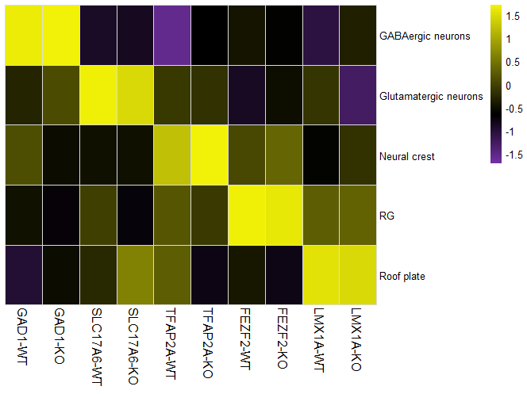

# GALILEO
GALILEO: Gene AccessibiLIty score to Locate Enhancer-of-Origin

## Installation

To install GALILEO, first install the devtools package, if it is not already installed:

```R
install.packages("devtools") 
```

Then, install GALILEO from GitHub:

```R
devtools::install_github("Zhao-YY/GALILEO")
```

 This should take no more than a few minutes. 

## Usage

Firstly , we create a tile matrix (user-defined tile size, default is 500 bp),the exon region, blacklist region and CpG island region overlapped by TSS are removed.  This task is done by the function `getBinByCellMatrix`, and it takes as input a preprocessed fragment information in scATAC-seq data  with 'RG' column containing cell barcodes. And genes, CpG, exon, blacklist region information  with the same genomic version as the fragment information. These messages are in GRanges format. Then we can get the BinByCell matrix.

```R
binByCell = getBinByCellMatrix(frag,genes,CpG,exon,Blacklist)
```

Secondly, 1000 cells were randomly selected from each group, and sum the accessibility of cells extracted from each group. The summed accessibility then multiplied by normalization factors. The normalization factors to counterbalance sequencing depth were calculated as 10^7 divided by the sum of nFrags per group. The `getBinByGroupMatrix` function, takes as input the BinByCell matrix obtained by the `getBinByCellMatrix` function and a data frame containing metadata associated with each cell, minimally including the cell group labels.  You can specify group column these using the `group_col` arguments: 

```R
binByGroup_norm=getBinByGroupMatrix(binByCell,cell_anno,group_col="cellTtypes_condition")
```

Thirdly, we filter out the bin that might be noisy, that is, the bin that has a smaller maximum accessibility. And select of highly variable bin based on the ratio of maximum to minimum accessibility of bin in each group. The `getHVbinMatrix` function,  takes as input the binByGroup_norm matrix obtained by the `getBinByGroupMatrix` function and the threshold `bin_max_thr` and `bin_fc_thr` to get high variation bin.

```
binByGroup_norm_HVbin = getHVbinMatrix(binByGroup_norm,bin_max_thr=7,bin_fc_thr=70)
```

Finally, for each gene, GALILEO use `getGeneByGroupMatrix` function to sum the accessibility of highly variable bins that overlaps with the gene window (user-defined, default is 2 kb upstream and downstream of the gene body) and do not cross another gene region. And we can get the GeneByGroup matrix.

```R
GeneByGroup = getGeneByGroupMatrix(genes,binByGroup_norm_HVbin)
```


##  Plot the results 

 We can use the `peatmap` package to show some marker genes.

```R
library(stringr)
library(pheatmap)

gene = c('GAD1','SLC17A6','TFAP2A','FEZF2','LMX1A') 
data = as.data.frame(t(as.matrix(GeneByGroup[gene,-c(1,2,7,8)])))

nn = unique(gsub("-KO|-WT","",rownames(data)))
cc = c(paste0(colnames(data),"-WT"),paste0(colnames(data),"-KO"))[c(1,6,2,7,3,8,4,9,5,10)]
data2 = data.frame(row.names = nn)
for(i in cc){
  ss = str_split(i,"-",simplify = T)
  r = grep(ss[2],rownames(data))
  co = grep(ss[1],colnames(data))
  data2[,i] = data[r,co]
}

pal <- colorRampPalette( c("#7431A6","#000000","#F2F208"),bias = 1.7 )(255)

options(repr.plot.width=8, repr.plot.height=5)
pheatmap(data2,
         fontsize_col=12,
         color = pal,
         border_color = "#dcdcdc",
         scale = "column",
         cluster_rows = F,
         cluster_cols = F,
         width = 6,
         height = 3
)
```

